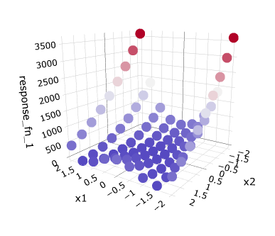

# Summary

This example demonstrates a 3D scatter plot of data from the Rosenbrock curve.  The scatter plot was produced using Dakota GUI.

# Description

The Rosenbrock curve is a common function used in mathematical optimization as a performance test problem.  The Rosenbrock function can be described as follows:

$` f(x,y) = (a-x)^2 + b(y-x^2)^2 `$

The unique solution to this problem lies at the point (x1, x2) = (1, 1), where the function value is zero.

# Contents

- `rosen_multidim.dat` - a Dakota tabular data file, previously produced by running the `rosen_multidim.in` input file provided with this example. 
- `rosen_multidim.in` - the original Dakota input file that studies the Rosenbrock curve, using a *multidim\_parameter\_study* method.
- `TabularDataSet1.plot` - a previously-generated plot file representing data from the Rosenbrock curve.  This plot is viewable in Dakota GUI.

# How to run the example

- Open Dakota GUI.
- Import this example into your workspace.
- Double-click the TabularDataSet1.plot file to view the plot.

# How to create a new plot

- Open Dakota GUI.
- Import this example into your workspace.
- Right-click the rosen_multidim.dat tabular data file, and choose `Chartreuse > New plot trace from this file.`
 - You should see the Plot Trace Creator dialog open, with your tabular data pre-selected as "Tabular Data Set 1."
- Choose "Scatter 3D Plot" from the "Plot Type" dropdown menu.
- Choose the X, Y, and Z data you would like to plot from the respective dropdown menus.  We recommend "x1" for X, "x2" for Y, and "response_fn_1" for Z.
- You can optionally specify the color of the trace.  The color can either be a single value, or a range of colors, as shown in the screenshot above.
- When you're finished, click OK.
- Your new plot file should auto-open in the main editor area of Dakota GUI.

# Further Reading

- [Read in the Dakota GUI manual about other types of plots that can be produced.](https://dakota.sandia.gov/content/chartreuse-1)