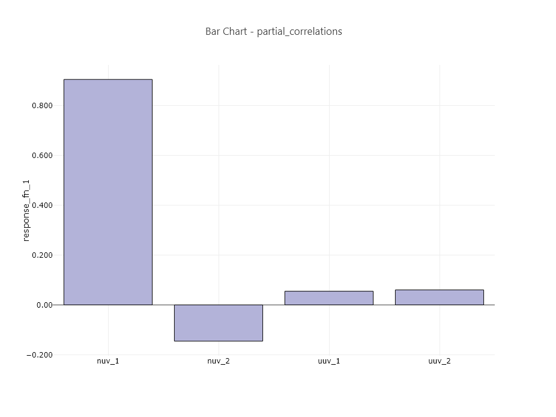
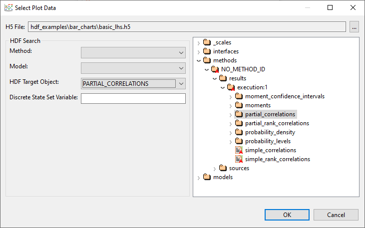

# Summary

This example demonstrates a bar chart plot of an LHS (Latin hypercube) study from Dakota.  The bar chart was produced using Dakota GUI.

# Description

After running a Dakota LHS study and producing an HDF5 dataset file, many useful datasets will be produced.  Among them are correlations between the variables and responses.  The bar chart plot shown above demonstrates how the Dakota input variables (nuv\_1, nuv\_2, uuv\_1, and uuv\_2) and correlated to the Dakota output response response\_fn\_1.

# Contents

- `BarChart-partial_correlations.plot` - the plot that demonstrates partial correlation bar charts, shown above.  The name describes both the type of plot (BarChart) and the HDF5 dataset from which the data originated (partial\_correlations).
- `basic_lhs.h5` - The original HDF5 database file that contains the results of the Dakota study.

# How to run the example

- Open Dakota GUI.
- Import this example into your workspace.
- Double-click the BarChart-partial_correlations.plot file to view the plot.

# How to create a new plot

- Open Dakota GUI.
- Import this example into your workspace.
- Right-click the basic_lhs.h5 file, and choose `Chartreuse > New plot trace from this file.`
- Click on the "Get Data" button (the folder-and-file icon) to choose an HDF5 dataset to plot.
- In the "Select Plot Data" dialog that opens, select "PARTIAL\_CORRELATIONS" from the "HDF Target Object" dropdown.  You should see the dialog locate the partial\_correlations dataset within the HDF5 hierarchy on the right side of the dialog.

- Click OK to close the dialog.
- Choose "Bar Chart" from the "Plot Type" dropdown menu.
- Choose "response\_fn\_1 [Response]" in the "Data" dropdown menu.
- Choose "Vertical" in the "Orientation" dropdown menu.
- You may optionally specify a color for the bar chart, which is recommended since black is the default color.
- When you're finished, click OK.
- Your new plot file should auto-open in the main editor area of Dakota GUI.

# Further Reading

- [Read in the Dakota GUI manual about other types of plots that can be produced.](https://dakota.sandia.gov/content/chartreuse-1)
- Learn about [simple correlation](https://en.wikipedia.org/wiki/Correlation_and_dependence), [rank correlation](https://en.wikipedia.org/wiki/Rank_correlation), and [partial correlation](https://en.wikipedia.org/wiki/Partial_correlation).