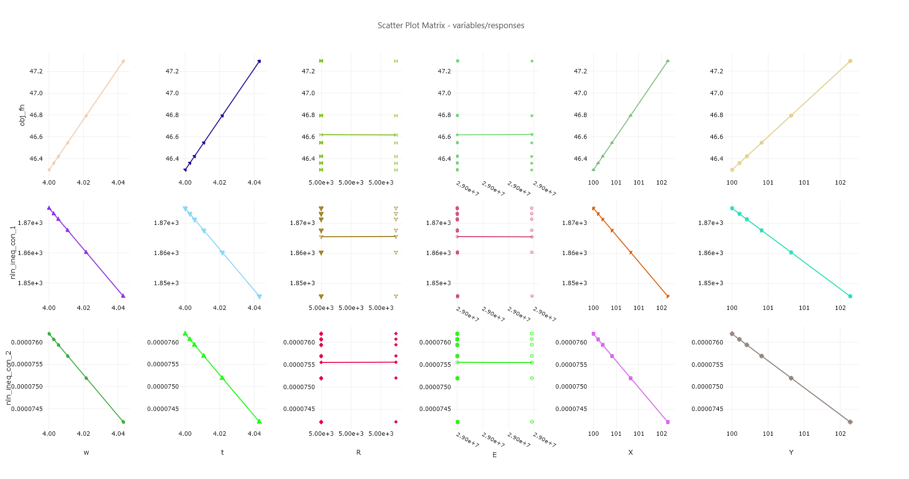

# Summary

This example demonstrates a scatter plot matrix template.  A scatter plot matrix allows you to quickly visualize the relationships between variables and responses.  The plot was produced using a plotting template in Dakota GUI.

# Description

A cantilever beam can be thought of as a rigid structural element that extends horizontally and is supported at only one end.

The cantilever beam model has six input parameters:

 - the width of the beam, **w**
 - the thickness of the beam, **t**
 - the stress constraint value, **R** (see Dakota User's Manual for a further explanation)
 - Young's modulus, **E**
 - the horizontal load on the beam, **X**
 - the vertical load on the beam, **Y**

For this example, the cantilever beam model produces the following output:

 - the **mass** of the beam
 - the **stress** on the beam
 - the **displacement** of the beam

The `optpp_q_newton` optimization method was applied to the cantilever beam model in the study plotted above.  We treated "mass" as our objective function, while "stress" and "displacement" are treated as nonlinear inequality constraints.  The study's output responses were grouped together and displayed on overlapping, non-shared canvases.  This was done to demonstrate the relative optimization path that each response explored on the way to the optimal solution.  Separate canvases with different scales were used to display the output responses together at the same scale. 

# Contents

- `ScatterPlotMatrix-variables_responses.plot` - the plot that demonstrates the scatter plot matrix template, shown above.  The name describes both the type of plot (ScatterPlotMatrix) and the HDF5 datasets from which the data originated (variables_responses).
- `dakota_results.h5` - The HDF5 output from running Dakota's optpp\_q\_newton method on the cantilever beam model.

# How to run the example

- Open Dakota GUI.
- Import this example into your workspace.
- Double-click the ScatterPlotMatrix-variables_responses.plot file to view the plot.

# How to create a new plot

- Open Dakota GUI.
- Import this example into your workspace.
- Right-click the dakota_results.h5 file, and choose `Chartreuse > New plot template from this file`.
- Choose "Scatter Plot Matrix" from the "Select Template" dropdown.
- Click on the "Get Data" button (the folder-and-file icon) to choose an HDF5 dataset to plot.
- In the "Select Plot Data" dialog that opens, select either "VARIABLES" or "RESPONSES" from the "HDF Target Object" dropdown.  You should see the dialog locate the variables or responses dataset within the HDF5 hierarchy on the right side of the dialog, along with an informational message along the top of the dialog that states that both variables and responses datasets will be retrieved.
- Click OK to close the dialog.
- Choose "Subset A to Subset B" from the "Choose a type of scatter plot" dropdown.  This option will allow you to plot variable data against response data.  The other option is "All to All," which plots all variables and all responses against each other, leading to a grid that will contain mirrored data.
- Choose "All variables" from the X Axis dropdown.
- Choose "All responses" from the Y Axis dropdown.
- Check "Draw Linear Regression" to show linear regression lines on each graph.
- Check "Text on Outer Axes Only" to limit X/Y canvas axis labels to the outer edges of the scatter plot matrix.  This is recommended for readability.
- Check "Ignore unchanging data" to throw away canvases where either the X axis data is unchanging or the Y axis data is unchanging.  This checkbox does not have an impact on the current plot data.
- When you're finished, click OK.
- The main Plot Window Manager dialog will appear, showing you a preview of what your plot template will look like.  You can verify that there will be a 6 x 3 grid of canvases, with variables being shown across the horizontal dimension, and responses being shown across the vertical dimension.
- If you are satisfied with the layout of the plot, click "Plot" in the lower-right corner of the dialog.
- Your new plot file should auto-open in the main editor area of Dakota GUI.

# Further Reading

- [Read in the Dakota GUI manual about other types of plots that can be produced.](https://dakota.sandia.gov/content/chartreuse-1)
- [Read about Dakota's optpp\\_q\\_newton method.](https://dakota.sandia.gov//sites/default/files/docs/latest_release/html-ref/method-optpp_q_newton.html)