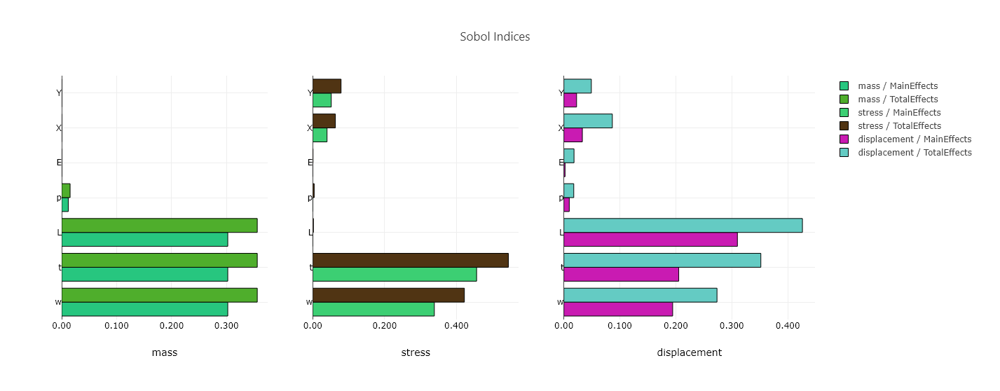

# Summary

This example demonstrates the Sobol indices plot template applied to a cantilever beam model.  The plot was produced using a plotting template in Dakota GUI.

# Description of the model

A cantilever beam can be thought of as a rigid structural element that extends horizontally and is supported at only one end.

The cantilever beam model has seven input parameters:

 - the width of the beam, **w**
 - the thickness of the beam, **t**
 - the length of the beam, **L**
 - the density of the beam, **p**
 - Young's modulus, **E**
 - the horizontal load on the beam, **X**
 - the vertical load on the beam, **Y**

For this example, the cantilever beam model produces the following output:

 - the **mass** of the beam
 - the **stress** on the beam
 - the **displacement** of the beam

# Description of the method

Variance-based sensitivity analysis attributes response, or output, variance to variability in individual input variables. This approach is also known as the Sobol method, after the Russian mathematician. It is based on a decomposition of the response function f of interest into mutually orthogonal functions of one or more input variables.

For some functions with explicit algebraic form, it is possible to analytically calculate Sobol main and total effects. This is the case for Dakota's orthogonal polynomial models, available through the `polynomial_chaos` method specification. 

# Contents

- `SobolIndices.plot` - The plot that demonstrates the Sobol indices plot template shown above.
- `pce_vbd.h5` - The HDF5 output that was generated from a polynomial chaos expansion study.

# How to run the example

- Open Dakota GUI.
- Import this example into your workspace.
- Double-click the ScatterPlotMatrix-variables_responses.plot file to view the plot.

# How to create a new plot

- Open Dakota GUI.
- Import this example into your workspace.
- Right-click the pce_vbd.h5 file, and choose `Chartreuse > New plot template from this file`.
- Choose "Sobol Indices" from the "Select Template" dropdown.  Everything will be auto-selected for you, including the main_effects and total_effects datasets from the HDF5 file.
- You may optionally decide how the canvases should be grouped (one canvas per response, one canvas per effect, or both).  Also, you may choose to sort the effects (i.e. a tornado plot).
- When you're finished, click OK.
- The main Plot Window Manager dialog will appear, showing you a preview of what your plot template will look like.
- If you are satisfied with the layout of the plot, click "Plot" in the lower-right corner of the dialog.
- Your new plot file should auto-open in the main editor area of Dakota GUI.

# Further Reading

- [Read in the Dakota GUI manual about other types of plots that can be produced.](https://dakota.sandia.gov/content/chartreuse-1)
- [Read about Dakota's polynomial_chaos method.](https://dakota.sandia.gov//sites/default/files/docs/latest_release/html-ref/method-polynomial_chaos.html)
- [Read about Sobol indices.](https://en.wikipedia.org/wiki/Variance-based_sensitivity_analysis)