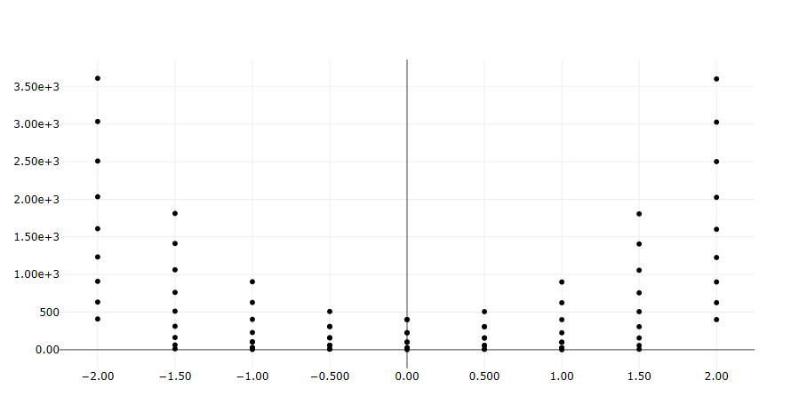

# Summary

This example demonstrates a 2D scatter plot of data from the Rosenbrock curve.  The scatter plot was produced using Next-Gen Workflow, a tool provided in Dakota GUI.

 
# Description

The Rosenbrock curve is a common function used in mathematical optimization as a performance test problem.  The Rosenbrock function can be described as follows:

$` f(x,y) = (a-x)^2 + b(y-x^2)^2 `$

The unique solution to this problem lies at the point (x1, x2) = (1, 1), where the function value is zero.

# Contents

- `ScatterPlot.iwf` - a workflow file that extracts data from rosen_multidim.dat and creates a scatter plot.
- `ScatterPlot.plot` - a previously-generated plot file representing data from the Rosenbrock curve.  This plot is viewable in Dakota GUI.
- `rosen_multidim.dat` - a Dakota tabular data file, previously produced by running a Dakota input file that explored the Rosenbrock curve. 

# How to run the example

- Open Dakota GUI.
- Import this example into your workspace.
- Double-click the ScatterPlot.plot file to view the plot.

# How to create a new plot

- Open Dakota GUI.
- Import this example into your workspace.
- Double-click ScatterPlot.iwf.
- Click on one of the two green play buttons in the action ribbon:

- The left play button allows you to define a custom location for running the workflow, while the right play button will run the workflow in the default location, which is a directory called "ScatterPlot", located in the same parent directory as ScatterPlot.iwf.
- After running, a new "ScatterPlot" directory will be created, and a new "ScatterPlot.plot" will be located inside.  Additionally, this workflow has been built to automatically open the new plot file as soon as it is generated.

# Further Reading

- [Read in the Dakota GUI manual about other types of plots that can be produced.](https://dakota.sandia.gov/content/chartreuse-1)
- To learn more about an individual node in Next-Gen Workflow, use the built-in help files by clicking on a node, then clicking on the question mark icon in the Settings Editor view.